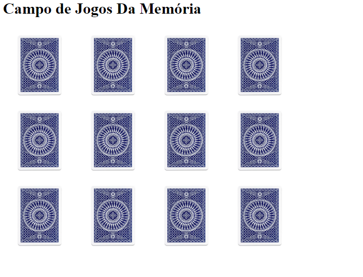

# Projeto Jogo da memória encantada

### Projeto do curso da escola @koru, para o projeto de metodologias ágeis

#### Este projeto visa auxiliar as pessoas da terceira idade, para ajuda no processo de memorização, podendo evitar problemas de esquecimento de horários de medicamentos, e outros problemas que isso possa causar.

O jogo consiste em encontrar os pares de cada celebridade.

As cartas virão todas fechadas

Foram escolhidos celebridades aleatórios da terceira idade; O cantores Roberto Carlos e Fafá de Belém, O apresentaroes, Silvio Santos, Ana Maria Braga, Nelson Rubens, e a ex-apresentadora, Palmirinha. Com intuito de gerar maior indentificação e interesse com o público alvo desse jogo.

### Tecnologias utilizadas, HTML + CSS + JS.

😁 +1, eses aí já subiu...pro git, claro!